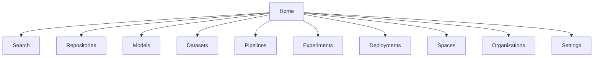
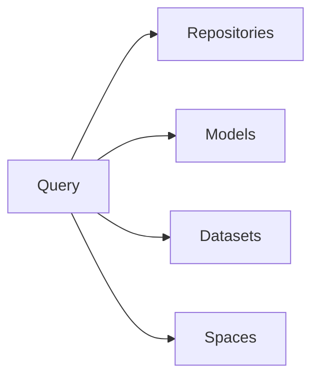
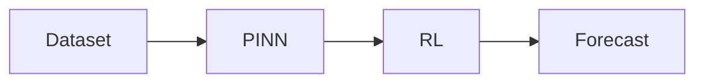
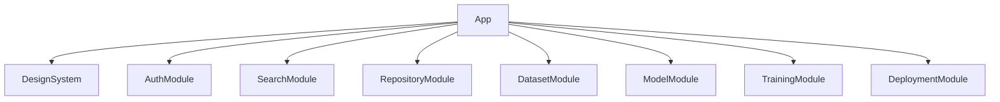

# WEB_INTERFACE_PRD.md

# Product Requirements Document (PRD)

## Aether Web Platform

**Version:** 1.0
**Owner:** Product & Platform Team
**Status:** Design Phase
**Priority:** Platform Critical

---

# 1. Overview

## Purpose

The Aether Web Platform is the primary user-facing interface for the Aether ecosystem.

It provides a unified experience for:

* Model development
* Dataset management
* Training
* Inference
* Repository hosting
* Experiment tracking
* Search and discovery
* Pipeline orchestration
* Space deployment
* Organization management
* Analytics and monitoring

The experience should combine the best aspects of:

* GitHub
* Hugging Face
* MLflow
* Databricks
* Weights & Biases
* AWS SageMaker

into a single platform.

---

# 2. Product Vision

Enable users to:

```text
Build

Train

Deploy

Discover

Collaborate

Monitor

Monetize
```

AI systems from a single platform.

---

# 3. Primary Personas

## ML Engineer

Needs:

* Model repositories
* Training jobs
* Deployments
* Monitoring

---

## Data Scientist

Needs:

* Dataset exploration
* Experiments
* Notebooks
* Visualizations

---

## Researcher

Needs:

* Publishing models
* Sharing datasets
* Collaboration

---

## Organization Admin

Needs:

* User management
* Security
* Billing
* Governance

---

## Application Developer

Needs:

* Inference APIs
* SDKs
* Deployments

---

# 4. Platform Structure



---

# 5. Navigation Architecture

## Global Navigation

```text
Aether Logo

Search

Repositories

Models

Datasets

Pipelines

Experiments

Deployments

Spaces

Organizations

Notifications

Profile
```

---

# 6. Home Dashboard

## Purpose

Central landing page.

---

### Widgets

Recent Activity

```text
Training Completed

Model Deployed

Dataset Uploaded

Pipeline Executed
```

---

Quick Actions

```text
New Model

New Dataset

Launch Training

Deploy Model
```

---

Personal Metrics

```text
Models

Datasets

Inference Calls

Storage Usage
```

---

Recent Resources

```text
Repositories

Datasets

Experiments

Deployments
```

---

# 7. Global Search

## Purpose

Universal discovery.

---

### Search Scope

```text
Repositories

Models

Datasets

Experiments

Spaces

Organizations

Users
```

---

### Search Features

```text
Autocomplete

Filters

Semantic Search

Vector Search

Recent Searches
```

---

### Search Page



---

# 8. Repository Experience

Repository becomes the central unit.

---

## URL Structure

```text
/{owner}/{repository}
```

Example:

```text
/thomas/geothermal-pinn
```

---

## Repository Tabs

```text
Overview

Files

Versions

Models

Datasets

Pipelines

Experiments

Deployments

Settings
```

---

## Repository Overview

Displays:

```text
README

Metadata

Tags

License

Downloads

Stars

Usage Statistics
```

---

# 9. Model Hub

## Model Listing

Displays:

```text
Model Name

Owner

Task

Framework

Downloads

Likes

Last Updated
```

---

## Model Detail Page

### Sections

```text
Model Card

Versions

Inference API

Training History

Deployments

Metrics

Examples
```

---

### Actions

```text
Download

Deploy

Run Inference

Clone

Fork
```

---

# 10. Dataset Hub

## Dataset Listing

Displays:

```text
Name

Owner

Rows

Size

Tags

Downloads
```

---

## Dataset Detail Page

### Sections

```text
Overview

Schema

Versions

Profiles

Validation

Lineage

Files
```

---

### Data Preview

Supports:

```text
Tables

JSON

Images

Time Series

Graphs
```

---

# 11. Training Interface

## Training Job Creation

Wizard:

```text
Select Dataset

Select Model

Configure Training

Choose Hardware

Launch
```

---

### Training Dashboard

Displays:

```text
Status

GPU Usage

Loss Curves

Metrics

Logs

Artifacts
```

---

### Real-Time Updates

Via:

```text
WebSockets
```

---

# 12. Experiment Tracking

Similar to Weights & Biases.

---

## Experiment Page

Displays:

```text
Parameters

Metrics

Artifacts

Visualizations

Comparisons
```

---

## Experiment Comparison

Compare:

```text
Accuracy

Loss

F1

AUC

Custom Metrics
```

---

# 13. Deployment Center

## Deployment List

Displays:

```text
Model

Version

Status

Replicas

Latency

Traffic
```

---

## Deployment Detail

### Metrics

```text
Requests

Latency

Failures

GPU Usage

Cost
```

---

### Actions

```text
Scale

Pause

Resume

Delete
```

---

# 14. Inference Studio

Interactive model playground.

---

## Features

```text
Schema Discovery

Input Builder

Request Editor

Response Viewer

Explanation Viewer
```

---

### Example

```text
Model

↓

Input Form

↓

Run

↓

Prediction

↓

Explanation
```

---

# 15. Pipeline Studio

Visual DAG builder.

---

## Features

```text
Drag & Drop

Node Configuration

Execution History

Versioning

Scheduling
```

---

### Example



---

# 16. Space Platform

Equivalent of Hugging Face Spaces.

---

## Supported Frameworks

```text
React

Next.js

Streamlit

Gradio

Vue

Static Sites
```

---

## Space Detail

Displays:

```text
Description

Demo

Usage

Versions

Logs
```

---

# 17. Organization Console

## Features

```text
Members

Teams

Roles

Usage

Billing

Audit Logs
```

---

### Admin Dashboard

```text
Storage

Compute

Inference

Costs

Security
```

---

# 18. Analytics Dashboard

Powered by ClickHouse.

---

## Metrics

```text
Downloads

Inference Requests

Training Jobs

Storage

Revenue
```

---

## Visualization Types

```text
Line Charts

Bar Charts

Tables

Heatmaps

Maps
```

---

# 19. Notifications

Supports:

```text
Training Completed

Deployment Failed

Pipeline Failed

Dataset Updated

Repository Mentioned
```

---

Delivery Channels:

```text
In-App

Email

Slack

Webhook
```

---

# 20. User Settings

## Sections

```text
Profile

Security

API Keys

Notifications

Billing

Organizations
```

---

# 21. Mobile Responsiveness

Required Support:

```text
Desktop

Tablet

Mobile
```

---

# 22. Frontend Architecture

## Recommended Stack

```text
Next.js

TypeScript

React

TailwindCSS

TanStack Query

Zustand

React Flow

ECharts
```

---

## Architecture



---

# 23. Backend Integrations

| Service              | Integration  |
| -------------------- | ------------ |
| Auth Service         | Login & RBAC |
| Repository Service   | Repositories |
| Dataset Service      | Datasets     |
| Training Service     | Training     |
| Inference Service    | Inference    |
| Search Service       | Search       |
| Analytics Service    | Metrics      |
| Deployment Service   | Serving      |
| Notification Service | Alerts       |

---

# 24. Non-Functional Requirements

## Performance

Initial Page Load:

```text
< 2 seconds
```

---

Search:

```text
< 300 ms
```

---

Navigation:

```text
< 100 ms perceived
```

---

## Availability

```text
99.9%
```

---

## Accessibility

WCAG 2.1 AA compliant.

---

# 25. Design Principles

## GitHub-Inspired

For:

```text
Repositories

Versioning

Collaboration
```

---

## Hugging Face-Inspired

For:

```text
Models

Datasets

Spaces
```

---

## MLflow/W&B Inspired

For:

```text
Training

Experiments

Metrics
```

---

## Databricks Inspired

For:

```text
Analytics

Pipelines

Enterprise Features
```

---

# 26. Future Enhancements

## Phase 2

```text
Notebook Environment

Model Marketplace

Dataset Marketplace

Community Discussions
```

---

## Phase 3

```text
AI Assistant (Atlas)

Natural Language Analytics

AutoML

Agent Builder
```

---

# 27. Success Metrics

## Adoption

```text
Daily Active Users

Repositories Created

Models Uploaded

Datasets Uploaded
```

---

## Platform Usage

```text
Training Jobs

Inference Calls

Deployments

Pipeline Executions
```

---

## Business

```text
Paid Organizations

Revenue

Storage Consumption

GPU Utilization
```

---

# Definition of Done

The Aether Web Platform is complete when users can:

* Create and manage repositories
* Upload and discover models
* Upload and analyze datasets
* Launch training jobs
* Track experiments
* Deploy models
* Execute inference
* Build pipelines
* Manage organizations
* Monitor analytics
* Search across all platform assets

The web platform becomes the primary operating system for the entire Aether ecosystem, exposing every platform capability through a unified, modern, collaborative interface.

```
```
